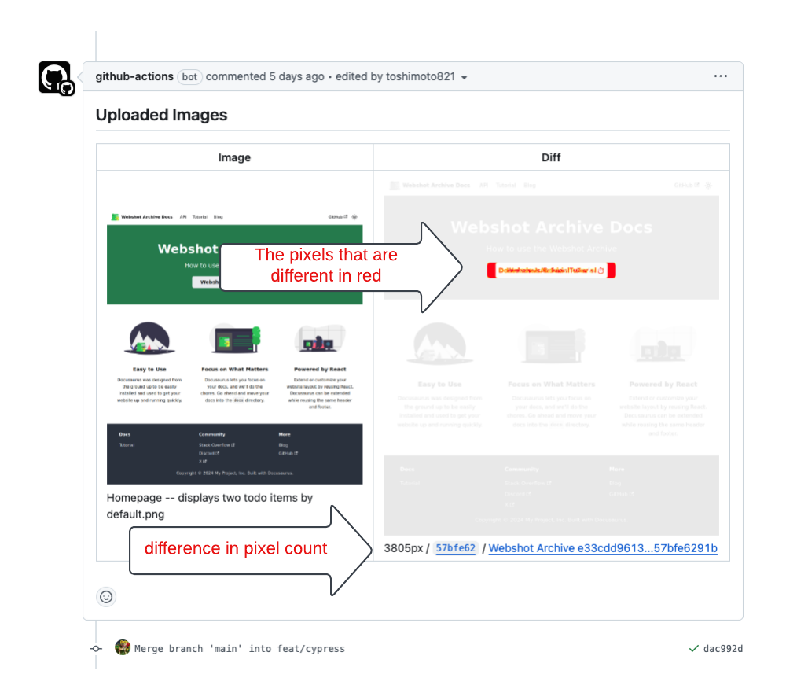
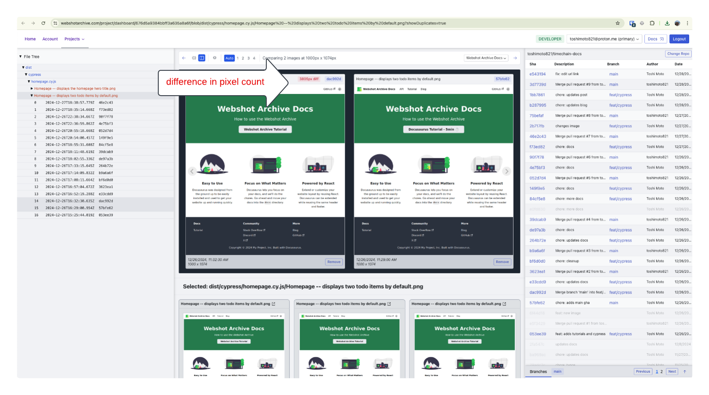

# Webshot Archive GitHub Action

[](https://github.com/super-linter/super-linter)


Use this action to integrate [Webshot Archive](https://www.webshotarchive.com)
into your GitHub Actions workflow. The action will upload images/screenshots
from your CI test runner to Webshot Archive. For actions that run on
`pull_request` events, the action will also comment on the PR with any
differences between the current branch and the target branch.

Integrates with GitHub Actions to comment on PRs with any differences between
the current branch and the target branch.



Use the Webshot Archive UI to view all screenshots and compare them side by
side. 

## Resources

- [Webshot Archive Site](https://www.webshotarchive.com)
- [Webshot Archive GitHub Action](https://github.com/toshimoto821/webshotarchive)
- [Webshot Archive Docs](https://docs.webshotarchive.dev/)
  - [Webshot Archive API](https://docs.webshotarchive.dev/docs/api)
  - [Recipes](https://docs.webshotarchive.dev/docs/recipes/push-pr-action)
  - [Tutorials](https://docs.webshotarchive.dev/docs/intro)

## Initial Setup

Prior to installing this action you will need to create a Webshot Archive
service account with client ID and secret. Follow the instructions on the
[Webshot Archive Docs](https://docs.webshotarchive.dev/docs/tutorial-basics/create-client-credentials)
to generate these credentials.

> [!NOTE]
>
> You will need to have a paid plan to use this action. Plans start for as
> little as $5/month and new accounts receive 14 day free trial. I'm a solo
> developer and the service is not free to me to host and neither is my time.
> Donate to developer, just trying to have a side project that pays the bills.
>
> Reach out to me on [Discord](https://discord.gg/u8DEaW9z) if you want to say
> hello.

Below is an example of how to install this action in a GitHub Actions workflow.

```yaml
on:
  push: # running on push will use previous commit to compare against
    branches:
      - main # or any other branch you want to run this action on
  pull_request: # running on pull_request will use base branch to compare against

permissions:
  actions: read # required for action to run
  contents: read
  issues: write # required for PR comments
  pull-requests: write # required for PR comments

jobs:
  main:
    runs-on: ubuntu-latest # or any other runner you want to use
    steps:
      # ...
      # previous steps should run your tests and generate screenshots locally
      # ...

      - name: WebshotArchive Action
        uses: toshimoto821/webshotarchive@v0.0.6
        env:
          GITHUB_TOKEN: ${{ secrets.GITHUB_TOKEN }}
        with:
          screenshotsFolder: dist/cypress # path to where your screenshots are written
          clientId: ${{ secrets.CLIENT_ID }}
          clientSecret: ${{ secrets.CLIENT_SECRET }}
          projectId: ${{secrets.PROJECT_ID}}
```

See the [Getting Started](https://docs.webshotarchive.dev/docs/intro) docs for
more details.

## API

The action supports the following paramets to `with:`

| Parameter         | Type    | Required | Default (Pull Request)                      | Default (Push)               | Description                                      |
| ----------------- | ------- | -------- | ------------------------------------------- | ---------------------------- | ------------------------------------------------ |
| screenshotsFolder | string  | Yes      | -                                           | -                            | The folder containing the screenshots to upload. |
| clientId          | string  | Yes      | -                                           | -                            | Your client ID.                                  |
| clientSecret      | string  | Yes      | -                                           | -                            | Your client secret.                              |
| projectId         | string  | Yes      | -                                           | -                            | The Webshot Archive projectId.                   |
| commitSha         | string  | No       | `${{github.event.pull_request.head.sha }}`  | `${{ github.event.after }}`  | The commit SHA represented in the screenshot     |
| compareCommitSha  | string  | No       | `${{ github.event.pull_request.base.sha }}` | `${{ github.event.before }}` | The commit SHA to compare with.                  |
| branchName        | string  | No       | `${{ github.head_ref }}`                    | `${GITHUB_REF##*/}`          | The branch associated with the screenshot.       |
| mergedBranch      | string  | No       | -                                           | \* see below                 | The branch that was merged.                      |
| comment           | boolean | No       | true                                        | false                        | Whether to comment on the PR.                    |
| tags              | string  | No       | \* see below                                | \* see below                 | Tags to add to the screenshots.                  |

### Notes

- `compareBranch`: Is deprecated and will be removed in a future release.
- `mergedBranch`: The merged branch logic is handled by the Webshot Archive API
  [here](https://github.com/toshimoto821/webshotarchive/blob/main/src/defaultFields.js#L31-L95).
  The point is to have the merged branch be the branch that was merged into.
- `tags`: The tags logic is handled by the Webshot Archive API
  [here](https://github.com/toshimoto821/webshotarchive/blob/main/src/main.js#L192-L205).
  Key points:
  - images ending in (failed).png get `failed` tag.
  - images with title tags-[tag1, tag2, tag3] get the tags `tag1`, `tag2`,
    `tag3`.

---

---

## Need Help?

- [Discord](https://discord.gg/u8DEaW9z) - say hi and ask questions.
- [Webshot Archive Docs](https://docs.webshotarchive.dev) - API Details,
  tutorials, recipes, and blog posts.
- [Create an Issue](https://github.com/webshotarchive/github-action/issues/new) -
  Report a bug or request a feature.
