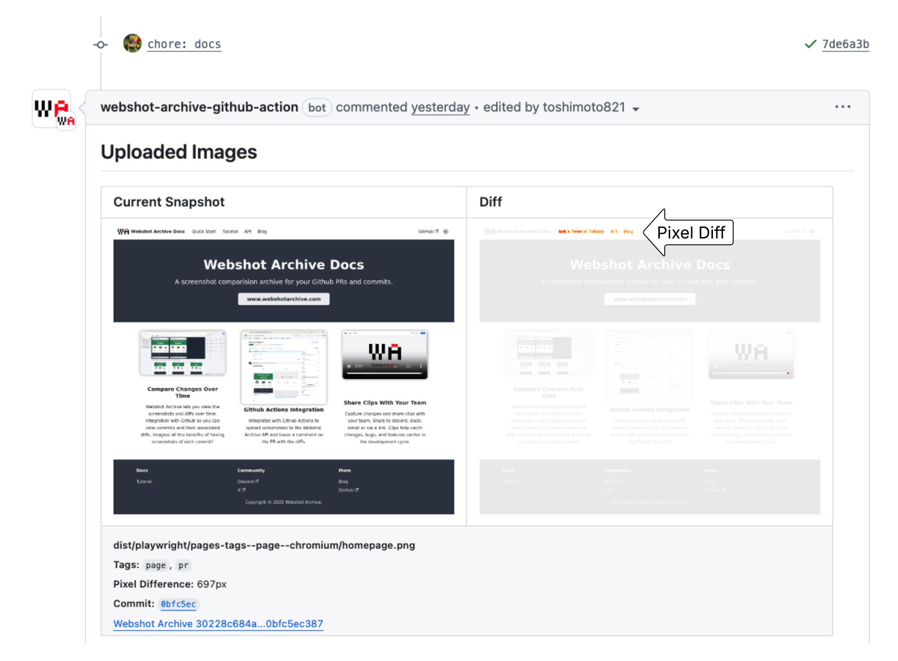

# Webshot Archive GitHub Action

[](https://github.com/super-linter/super-linter)

[](LICENSE)

> **Automate visual regression testing in your GitHub Actions workflow**

The Webshot Archive GitHub Action seamlessly integrates
[Webshot Archive](https://www.webshotarchive.com) into your CI/CD pipeline.
Upload screenshots from your test runner and automatically detect visual
differences between branches, with intelligent PR commenting for effortless code
review.

## ✨ Features

- 🔄 **Automatic Screenshot Upload**: Upload test screenshots directly from your
  CI runner
- 📊 **Visual Diff Detection**: Compare screenshots between branches
  automatically
- 💬 **Smart PR Comments**: Get detailed visual diff reports in your pull
  requests
- 🏷️ **Tagged Screenshots**: Automatic tagging for failed tests and custom
  categories
- 🔧 **Flexible Configuration**: Support for both push and pull request
  workflows
- 🎯 **Configurable Noise Control**: Adjustable thresholds to minimize false
  positives and handle visual noise

## 🚀 Quick Start

### 1. Create Account & Get Credentials

1. **Sign up** for a [Webshot Archive account](https://www.webshotarchive.com)
   (freemium available)
1. **Create client credentials** by following the
   [setup guide](https://docs.webshotarchive.com/docs/tutorial-basics/create-client-credentials)
1. **Add credentials** to your GitHub repository secrets:
   - `CLIENT_ID` - Your Webshot Archive client ID
   - `CLIENT_SECRET` - Your Webshot Archive client secret
   - `PROJECT_ID` - Your Webshot Archive project ID

### 2. Install the GitHub App

For PR commenting functionality, install the
[Webshot Archive GitHub Action App](https://github.com/apps/webshot-archive-github-action/installations/new)
to grant necessary permissions.

### 3. Add to Your Workflow

```yaml
name: Visual Regression Tests

on:
  push:
    branches: [main]
  pull_request:
    branches: [main]

jobs:
  visual-tests:
    runs-on: ubuntu-latest
    steps:
      # Your existing test steps that generate screenshots
      - name: Run Visual Tests
        run: |
          npm run test:visual
          # or your existing test command

      # Upload screenshots to Webshot Archive
      - name: Upload to Webshot Archive
        uses: webshotarchive/github-action@latest
        with:
          screenshotsFolder: dist/cypress/screenshots #path to images
          clientId: ${{ secrets.CLIENT_ID }}
          clientSecret: ${{ secrets.CLIENT_SECRET }}
          projectId: ${{ secrets.PROJECT_ID }}
```

### 4. View Results

- **PR Comments**: Automatic visual diff reports appear in your pull requests
- **Webshot Archive UI**: View all screenshots and compare them side-by-side
- **Dashboard**: Track visual changes across your entire project




## 📖 Documentation

- **[Getting Started Guide](https://docs.webshotarchive.com/docs/intro)** -
  Complete setup instructions
- **[API Reference](https://docs.webshotarchive.com/docs/api)** - Detailed API
  documentation
- **[Recipes & Examples](https://docs.webshotarchive.com/docs/recipes/push-pr-action)** -
  Common use cases
- **[Tutorials](https://docs.webshotarchive.com/docs/intro)** - Step-by-step
  guides

## ⚙️ Configuration

### Basic Usage

```yaml
- name: Webshot Archive Action
  uses: webshotarchive/github-action@latest
  with:
    screenshotsFolder: dist/cypress/screenshots
    clientId: ${{ secrets.WEBSHOT_CLIENT_ID }}
    clientSecret: ${{ secrets.WEBSHOT_CLIENT_SECRET }}
    projectId: ${{ secrets.WEBSHOT_PROJECT_ID }}
```

### Advanced Configuration

```yaml
- name: Webshot Archive Action
  uses: webshotarchive/github-action@latest
  with:
    screenshotsFolder: dist/cypress/screenshots
    clientId: ${{ secrets.WEBSHOT_CLIENT_ID }}
    clientSecret: ${{ secrets.WEBSHOT_CLIENT_SECRET }}
    projectId: ${{ secrets.WEBSHOT_PROJECT_ID }}
    comment: true # Enable PR comments (default: true for PRs)
    tags: 'ci,visual-testing' # Add custom tags
    commitSha: ${{ github.sha }} # Custom commit SHA
    branchName: ${{ github.head_ref }} # Custom branch name
```

### Upload Only (No Comments)

```yaml
- name: Webshot Archive Action
  uses: webshotarchive/github-action@latest
  with:
    screenshotsFolder: dist/cypress/screenshots
    clientId: ${{ secrets.WEBSHOT_CLIENT_ID }}
    clientSecret: ${{ secrets.WEBSHOT_CLIENT_SECRET }}
    projectId: ${{ secrets.WEBSHOT_PROJECT_ID }}
    comment: false # Disable PR comments
```

## 📋 Parameters Reference

| Parameter           | Type    | Required | Default (PR)                              | Default (Push)             | Description                        |
| ------------------- | ------- | -------- | ----------------------------------------- | -------------------------- | ---------------------------------- |
| `screenshotsFolder` | string  | ✅       | -                                         | -                          | Path to screenshots directory      |
| `clientId`          | string  | ✅       | -                                         | -                          | Your Webshot Archive client ID     |
| `clientSecret`      | string  | ✅       | -                                         | -                          | Your Webshot Archive client secret |
| `projectId`         | string  | ✅       | -                                         | -                          | Your Webshot Archive project ID    |
| `commitSha`         | string  | ❌       | `${{github.event.pull_request.head.sha}}` | `${{github.event.after}}`  | Commit SHA for screenshots         |
| `compareCommitSha`  | string  | ❌       | `${{github.event.pull_request.base.sha}}` | `${{github.event.before}}` | Commit SHA to compare against      |
| `branchName`        | string  | ❌       | `${{github.head_ref}}`                    | `${GITHUB_REF##*/}`        | Branch name for screenshots        |
| `mergedBranch`      | string  | ❌       | -                                         | See notes below            | Branch that was merged             |
| `comment`           | boolean | ❌       | `true`                                    | `false`                    | Enable PR comments                 |
| `tags`              | string  | ❌       | See notes below                           | See notes below            | Custom tags for screenshots        |

### Important Notes

- **`compareBranch`**: ⚠️ **Deprecated** - Will be removed in a future release
- **`mergedBranch`**: Automatically handled by the Webshot Archive API for merge
  scenarios
- **`tags`**: Automatic tagging rules:
  - Files ending in `(failed).png` → `failed` tag
  - Files with `tags-[tag1,tag2,tag3]` in filename → `tag1`, `tag2`, `tag3` tags

## 🔗 Resources

- **[Webshot Archive](https://www.webshotarchive.com)** - Main site
- **[Documentation](https://docs.webshotarchive.com/)** - Complete docs
- **[GitHub Repository](https://github.com/webshotarchive/github-action)** -
  Source code
- **[API Reference](https://docs.webshotarchive.com/docs/api)** - REST API docs

## 🤝 Getting Help

- **[Discord Community](https://discord.gg/a9qkpVxPnF)** - Chat with the team
  and community
- **📚 [Documentation](https://docs.webshotarchive.com/)** - Comprehensive
  guides and tutorials
- **🐛
  [Report Issues](https://github.com/webshotarchive/github-action/issues/new)** -
  Bug reports and feature requests
- **💡
  [Examples](https://docs.webshotarchive.com/docs/recipes/push-pr-action)** -
  Real-world usage examples

---

<div align="center">
  <p>Made with ❤️ by the <a href="https://www.webshotarchive.com">Webshot Archive</a> team</p>
</div>
